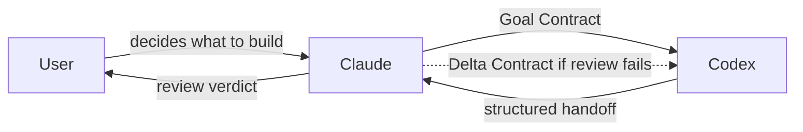
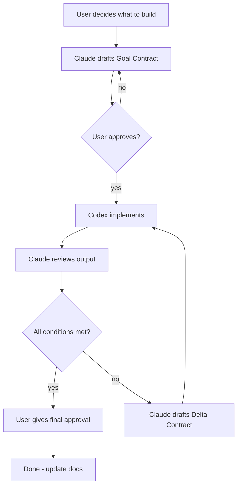

# claude2codex

An MCP server that lets Claude Code delegate implementation work to OpenAI Codex through structured contracts.

*[中文版](./README.zh-CN.md)*

## The Idea

Software development has distinct roles: **planning** what to build, **building** it, and **reviewing** the result. This project splits those roles between two AI agents:

- **Claude Code** — the architect and reviewer. Plans the work, writes specifications, reviews results.
- **OpenAI Codex** — the implementer. Receives specifications, writes code, runs tests, reports back.

You (the user) are the **commander** — you decide what to build and give final approval. Claude drafts the plan, Codex executes it, Claude verifies the output.



## What is a Goal Contract?

A Goal Contract is a structured specification that tells Codex *exactly* what to build. It has three parts:

| Section | Purpose |
|---------|---------|
| **Goal** | What the code must do when this task is done. |
| **Constraints** | Boundaries: which files to touch, patterns to follow, things *not* to modify. |
| **Success Conditions** | Checkable criteria that prove the goal is met. At least one must be a runnable test or command. |

Example:

```markdown
### Goal
Add a /health endpoint that returns 200 OK with the server version.

### Constraints
- Only modify src/routes.ts and src/routes.test.ts.
- Do not modify any existing endpoints.
- Follow the existing route registration pattern.

### Success Conditions
- [ ] GET /health returns 200 with JSON body {"version": "<package.json version>"}.
- [ ] `npm test` passes including a new test for the endpoint.
- [ ] No other routes are affected.
```

**Why structure it this way?** Codex works best with unambiguous, verifiable instructions. Vague requests produce vague results. The contract format forces clarity: what to do, what not to do, and how to prove it worked.

## What is a Delta Contract?

When Claude reviews Codex's output and finds problems, it doesn't start over — it sends a **Delta Contract** (a rework order) scoped to *only* what failed:

| Section | Purpose |
|---------|---------|
| **Findings** | What is wrong, with file/line references. |
| **Failed Conditions** | Which Success Conditions from the original contract did not pass. |

Codex resumes the same thread (keeping all context from the first attempt) and fixes only the identified issues.

## Full Workflow



## Three-Layer Prompt Architecture

When claude2codex sends work to Codex, the prompt is assembled from three layers:

1. **Protocol layer** (embedded in the MCP server) — universal rules: how to self-verify work, how to format the handoff, how to handle rework. These never change regardless of project.

2. **Project layer** (optional `AGENTS.md` in the working directory) — project-specific coding conventions, toolchain instructions, architectural constraints. Injected automatically when present.

3. **Task layer** (the Goal/Delta Contract itself) — the specific work to be done this time.

This separation means the MCP server works out of the box (layer 1 is always there), benefits from project context when available (layer 2), and carries the unique task specification (layer 3).

## Installation

Requires [Codex CLI](https://github.com/openai/codex) and Node.js 18+.

```sh
npx claude2codex
```

### MCP Configuration

Add to your Claude Code MCP settings:

```json
{
  "mcpServers": {
    "codex": {
      "command": "npx",
      "args": ["-y", "claude2codex"]
    }
  }
}
```

## Tools Provided

| Tool | Description |
|------|-------------|
| `codex_implement` | Start a Codex job from a Goal Contract. Returns a job ID immediately. |
| `codex_status` | Check job progress: state, turns, goal status, transcript. |
| `codex_result` | Fetch the finished job's structured handoff. |
| `codex_rework` | Resume the Codex thread with a Delta Contract. |
| `codex_config` | Read-only view of Codex's current model, version, and settings. |

## How the Goal Loop Works

Under the hood, each job:

1. Spawns a `codex app-server` process (Codex's JSON-RPC interface)
2. Starts (or resumes) a persisted thread
3. Sets a **thread goal** — the programmatic equivalent of Codex's `/goal` command
4. Sends the full contract as input

Codex then enters its goal-continuation loop: after each turn, it checks "did I achieve the goal?" If not, it keeps going. The job finishes when the goal reaches a terminal state (`complete` or `budget_limited`) or the thread goes quiet.

## Environment Variables

| Variable | Default | Description |
|----------|---------|-------------|
| `CODEX_BIN` | `codex` | Codex executable to launch |
| `CODEX_ARGS` | `app-server` | Space-separated Codex arguments |
| `CODEX_CWD` | Current directory | Default working directory for jobs |
| `CODEX_MODEL` | Codex default | Model override |
| `CODEX_APPROVAL_POLICY` | `never` | Approval policy (autonomous by default) |
| `CODEX_PERMISSIONS` | Unset | Permissions profile passed to Codex |
| `CODEX_JOB_TIMEOUT_MS` | `1800000` | Maximum job duration (30 min) |
| `CODEX_QUIET_MS` | `30000` | Quiet period before treating an active goal as finished |
| `GOAL_OBJECTIVE_MAX` | `2000` | Maximum goal-objective string length |

## Development

```sh
cd mcp
bun install
bun test          # e2e tests against a mock codex (no real API calls)
npm run build     # produces dist/server.js
```

## License

MIT
