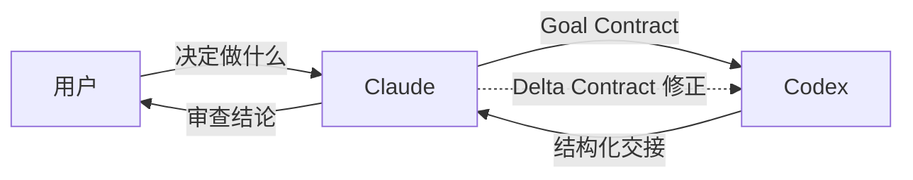
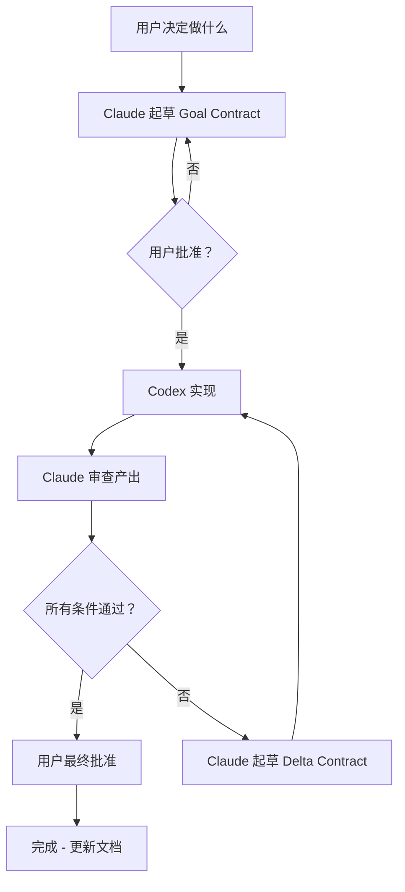

# claude2codex

一个 MCP 服务器，让 Claude Code 通过结构化契约将实现工作委派给 OpenAI Codex。

*[English](./README.md)*

## 核心理念

软件开发有不同的角色：**规划**做什么、**动手**写代码、**审查**结果。本项目把这些角色分配给两个 AI 智能体：

- **Claude Code** — 架构师和审查者。制定计划，撰写规格说明，审查产出。
- **OpenAI Codex** — 实现者。接收规格说明，编写代码，运行测试，报告结果。

你（用户）是**指挥官** — 决定做什么并给最终批准。Claude 起草方案，Codex 执行，Claude 核验产出。



## 什么是 Goal Contract（目标契约）？

Goal Contract 是一份结构化规格说明，精确告诉 Codex **要做什么**。它由三部分组成：

| 部分 | 作用 |
|------|------|
| **Goal（目标）** | 任务完成后代码应该达到的状态。 |
| **Constraints（约束）** | 边界条件：该动哪些文件、遵循什么模式、哪些东西*不能*改。 |
| **Success Conditions（成功条件）** | 可验证的标准，证明目标已达成。至少一条必须是可运行的测试或命令。 |

示例：

```markdown
### Goal
添加一个 /health 端点，返回 200 OK 并包含服务器版本号。

### Constraints
- 只修改 src/routes.ts 和 src/routes.test.ts。
- 不修改任何已有端点。
- 遵循现有的路由注册模式。

### Success Conditions
- [ ] GET /health 返回 200，JSON body 为 {"version": "<package.json 版本>"}。
- [ ] `npm test` 通过，包含新端点的测试。
- [ ] 不影响其他路由。
```

**为什么要这样结构化？** Codex 在面对明确、可验证的指令时表现最佳。模糊的请求产生模糊的结果。契约格式强制你想清楚：做什么、不做什么、怎么证明做对了。

## 什么是 Delta Contract（差量契约）？

当 Claude 审查 Codex 的产出并发现问题时，不会从头来过 — 而是发送一份 **Delta Contract**（返工指令），只针对*失败的部分*：

| 部分 | 作用 |
|------|------|
| **Findings（发现）** | 什么地方有问题，附文件/行号引用。 |
| **Failed Conditions（失败条件）** | 原始契约中哪些 Success Conditions 没通过。 |

Codex 恢复同一个线程（保留第一次尝试的全部上下文），只修复被指出的问题。

## 完整工作流



## 三层 Prompt 架构

claude2codex 向 Codex 发送任务时，prompt 由三层组装而成：

1. **协议层**（内嵌在 MCP 服务器中）— 通用规则：如何自我验证、如何格式化交接报告、如何处理返工。无论什么项目都一样。

2. **项目层**（可选，工作目录中的 `AGENTS.md`）— 项目特定的编码规范、工具链说明、架构约束。存在时自动注入。

3. **任务层**（Goal/Delta Contract 本身）— 这次要做的具体工作。

这种分离意味着：MCP 服务器开箱即用（第 1 层始终存在），有项目上下文时更好（第 2 层），每次任务都有独特的规格说明（第 3 层）。

## 安装

需要 [Codex CLI](https://github.com/openai/codex) 和 Node.js 18+。

```sh
npx claude2codex
```

### MCP 配置

添加到你的 Claude Code MCP 设置中：

```json
{
  "mcpServers": {
    "codex": {
      "command": "npx",
      "args": ["-y", "claude2codex"]
    }
  }
}
```

## 提供的工具

| 工具 | 说明 |
|------|------|
| `codex_implement` | 从 Goal Contract 启动一个 Codex 任务，立即返回 job ID。 |
| `codex_status` | 查看任务进度：状态、轮次、目标状态、活动记录。 |
| `codex_result` | 获取已完成任务的结构化交接报告。 |
| `codex_rework` | 用 Delta Contract 恢复 Codex 线程进行返工。 |
| `codex_config` | 只读查看 Codex 当前模型、版本和配置。 |

## Goal Loop 的工作原理

底层实现中，每个任务会：

1. 启动一个 `codex app-server` 进程（Codex 的 JSON-RPC 接口）
2. 创建（或恢复）一个持久化线程
3. 设置一个 **thread goal** — 相当于 Codex TUI 中 `/goal` 命令的编程等价物
4. 将完整契约作为输入发送

之后 Codex 进入目标持续循环：每一轮结束后它会检查"目标达成了吗？"如果没有，就继续。任务在目标达到终态（`complete` 或 `budget_limited`）或线程沉默时结束。

## 环境变量

| 变量 | 默认值 | 说明 |
|------|--------|------|
| `CODEX_BIN` | `codex` | Codex 可执行文件 |
| `CODEX_ARGS` | `app-server` | Codex 启动参数（空格分隔） |
| `CODEX_CWD` | 当前目录 | 任务默认工作目录 |
| `CODEX_MODEL` | Codex 默认 | 模型覆盖 |
| `CODEX_APPROVAL_POLICY` | `never` | 审批策略（默认自主执行） |
| `CODEX_PERMISSIONS` | 未设置 | 权限配置透传 |
| `CODEX_JOB_TIMEOUT_MS` | `1800000` | 单任务最大时长（30 分钟） |
| `CODEX_QUIET_MS` | `30000` | 判定活跃目标已完成前的静默等待时间 |
| `GOAL_OBJECTIVE_MAX` | `2000` | 目标字符串最大长度 |

## 开发

```sh
cd mcp
bun install
bun test          # 端到端测试（使用 mock，无需真实 API 调用）
npm run build     # 生成 dist/server.js
```

## 协议

MIT
