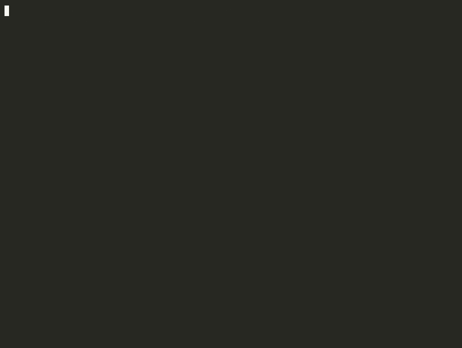
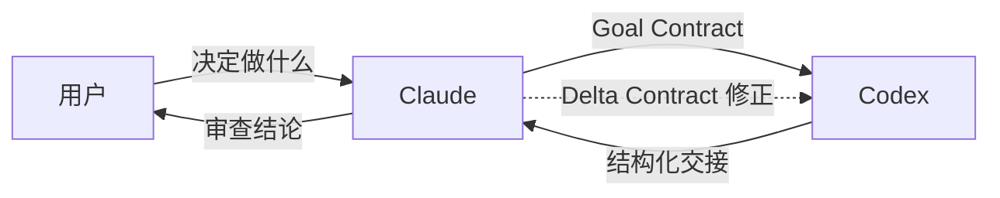
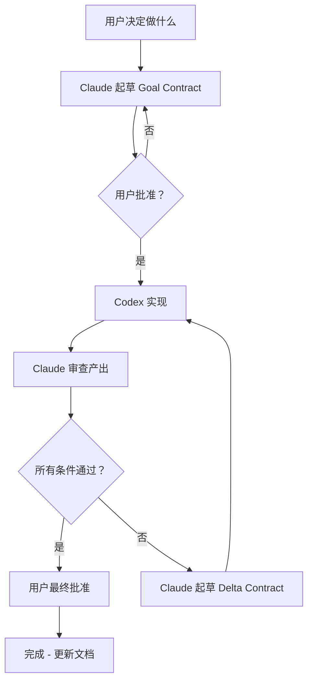

# claude2codex

一个 MCP 服务器，让 Claude Code 通过结构化契约将实现工作委派给 OpenAI Codex。

*[English](./README.md)*

## 演示

一次完整的workflow实践过程：Claude 起草 Goal Contract，`codex_estimate` 预估成本，Codex 在 goal loop 下自主实现（`codex_status` 实时流式进度），最后 Claude 独立复核 handoff。



*Codex 运行（13k tokens，50 秒），等待时间已压缩。终端回放：`asciinema play demo/demo.cast`*

## 为什么做这个项目

2025 年，AI 辅助编程的主流方式是写详细的 prompt 告诉模型*怎么*实现——改哪些文件、用什么模式、有时候几乎是伪代码。工程师是导演，AI 是需要不断指导的执行者。

这已经变了。2026 年，模型的[实现能力已经足够强](https://www.anthropic.com/institute/recursive-self-improvement)，事无巨细地指挥"怎么写"不再是人最好的时间投入方式。瓶颈转移了：当实现变得廉价，真正昂贵的错误是**定义了错误的问题**和**没有验收出坏的结果**。把实现步骤写对，远不如把目标定义对重要。

这就是为什么 Goal Contract 被设计成这样。它不解释怎么写代码——它定义**代码必须做到什么**（Goal），**要避免做什么**（Constraints）和**怎么证明做对了**（Success Conditions）。工程师的角色变成了问题定义、上下文补充和验收——和一个好的工程管理者委派任务时做的事情一样。

这个项目建立在这个前提上：把规划和审查（人的判断力仍然占主导）与实现（模型已经足够强）分开，用一种契约格式把它们连接起来，迫使工程师在最重要的部分(问题定义和验收标准)上做到清晰。


```mermaid
flowchart LR
    用户 -->|决定做什么| Claude
    Claude -->|Goal Contract| Codex
    Codex -->|结构化交接| Claude
    Claude -->|审查结论| 用户
    Claude -.->|Delta Contract 修正| Codex
```

- **你** — 决定做什么，给最终批准。
- **Claude Code** — 架构师和审查者。定义问题，撰写契约，验证结果。
- **OpenAI Codex** — 实现者。接收契约，编写代码，运行测试，报告结果。

## 什么是 Goal Contract（目标契约）？

Goal Contract 是一份结构化规格说明，精确告诉 Codex **要做什么**。它由三部分组成：

| 部分 | 作用 |
|------|------|
| **Goal（目标）** | 任务完成后代码应该达到的状态。 |
| **Constraints（约束）** | 边界条件：该动哪些文件、遵循什么模式、哪些东西*不能*改。 |
| **Success Conditions（成功条件）** | 可验证的标准，证明目标已达成。至少一条必须是可运行的测试或命令。 |

示例：

```markdown
### Goal
添加一个 /health 端点，返回 200 OK 并包含服务器版本号。

### Constraints
- 只修改 src/routes.ts 和 src/routes.test.ts。
- 不修改任何已有端点。
- 遵循现有的路由注册模式。

### Success Conditions
- [ ] GET /health 返回 200，JSON body 为 {"version": "<package.json 版本>"}。
- [ ] `npm test` 通过，包含新端点的测试。
- [ ] 不影响其他路由。
```

**为什么要这样结构化？** Codex 在面对明确、可验证的指令时表现最佳。模糊的请求产生模糊的结果。契约格式强制你想清楚：做什么、不做什么、怎么证明做对了。

更深入的实战指南——合同解剖、验证技巧、审查纪律、校准数字、反模式，全部提炼自"用这座桥构建本仓库自身功能"的真实过程——参见 **[PATTERNS.zh-CN.md](./PATTERNS.zh-CN.md)**。

## 什么是 Delta Contract（差量契约）？

当 Claude 审查 Codex 的产出并发现问题时，不会从头来过 — 而是发送一份 **Delta Contract**（返工指令），只针对*失败的部分*：

| 部分 | 作用 |
|------|------|
| **Findings（发现）** | 什么地方有问题，附文件/行号引用。 |
| **Failed Conditions（失败条件）** | 原始契约中哪些 Success Conditions 没通过。 |

Codex 恢复同一个线程（保留第一次尝试的全部上下文），只修复被指出的问题。

## 完整工作流


```mermaid
flowchart TD
    A[用户决定做什么] --> B[Claude 起草 Goal Contract]
    B --> C{用户批准？}
    C -->|是| D[Codex 实现]
    C -->|否| B
    D --> E[Claude 审查产出]
    E --> F{所有条件通过？}
    F -->|是| G[用户最终批准]
    F -->|否| H[Claude 起草 Delta Contract]
    H --> D
    G --> I[完成 - 更新文档]
```

## 三层 Prompt 架构

Codex 最终工作时的 prompt 由三层组成，但只有两层来自 claude2codex：

1. **协议层**（内嵌在 MCP 服务器中）— 通用规则：如何自我验证、如何格式化交接报告、如何处理返工。无论什么项目都一样。

2. **项目层**（`AGENTS.md`）— 项目特定的编码规范、工具链说明、架构约束。**由 Codex 自己加载，不是本服务器注入的。** Codex 会在工作目录所属的仓库树中查找 `AGENTS.md`（以及 `AGENTS.override.md`），放进它自己的 instructions 层，并受其 `project_doc_max_bytes` 预算约束。claude2codex 过去会重复注入一遍，现已移除。

3. **任务层**（Goal/Delta Contract 本身）— 这次要做的具体工作。

这种分离意味着：MCP 服务器开箱即用（第 1 层始终存在），直接继承 Codex 已经加载的项目上下文（第 2 层），每次任务都有独特的规格说明（第 3 层）。

注意：合同 prompt 和 **thread-goal objective** 是两个不同的字符串。objective 由 `goal` 加上每一条 `success_condition` 渲染而成，是 Codex `/goal` 循环在宣布目标达成前实际审查的对象，并有自己的 `GOAL_OBJECTIVE_MAX` 预算。详见 [PATTERNS.zh-CN.md](PATTERNS.zh-CN.md#objective-预算你的-success-conditions-有字符上限)。

## 安装

需要 [Codex CLI](https://github.com/openai/codex) 和 Node.js 18+。

```sh
npx claude2codex
```

### MCP 配置

添加到你的 Claude Code MCP 设置中：

```json
{
  "mcpServers": {
    "codex": {
      "command": "npx",
      "args": ["-y", "claude2codex"]
    }
  }
}
```

### 工作流 Prompt（自动）

服务器注册了一个 MCP Prompt（`c2c-workflow`），教 Claude 完整的契约工作流——角色分配、Goal/Delta Contract 格式、审查协议。**连接 MCP 服务器后自动加载。** 无需额外安装。

### 项目配置：CLAUDE.md 和 AGENTS.md

MCP 服务器负责工作流协议。你的项目文件只需要放**项目特有的上下文**——不要重复服务器已经提供的内容。

**`CLAUDE.md`**（给 Claude——架构师/审查者）：

```markdown
# Claude Code Guidelines

契约工作流由 MCP Prompt `c2c-workflow` 提供。

## 会话启动
开始时阅读 README.md 和 docs/design.md。

## 审查补充
- 标记安全问题（OWASP top 10）。
- 每个任务完成后跑一遍 staging 的集成测试。

## 约束
- 未经明确批准不得修改 migrations。
```

**`AGENTS.md`**（给 Codex——实现者）：

```markdown
# Codex Guidelines

你是实现者。契约协议由 c2c bridge 提供。

## 工具链
Python 3.12，Poetry。从项目根目录运行。
- `poetry run pytest` — 测试套件
- `poetry run ruff check .` — 代码检查
- `poetry run mypy .` — 类型检查

## 边界
- 不要直接修改 alembic migrations。
- 未经合同约束不得添加运行时依赖。
```

**什么放哪里：**

| | MCP 服务器（自动） | CLAUDE.md | AGENTS.md |
|---|---|---|---|
| 角色定义 | ✓ | — | — |
| 工作流步骤 | ✓ | — | — |
| 契约格式 | ✓ | — | — |
| 审查协议 | ✓ | — | — |
| 会话启动 | — | ✓ | ✓ |
| 项目特有的审查规则 | — | ✓ | — |
| 工具链与构建命令 | — | — | ✓ |
| 文件/依赖边界 | — | — | ✓ |

## 提供的工具

| 工具 | 说明 |
|------|------|
| `codex_implement` | 从 Goal Contract 启动一个 Codex 任务。支持 `context_files`（先读参考文件，校验存在性）和 `depends_on`（前序任务成功后才启动）。立即返回 job ID。 |
| `codex_status` | 查看任务进度：状态、队列位置、依赖、轮次、目标状态、token 用量、距上次活动的时间、活动记录。 |
| `codex_result` | 获取已完成任务的结构化交接报告。 |
| `codex_rework` | 用 Delta Contract 恢复 Codex 线程进行返工（同样支持 `context_files`）。 |
| `codex_estimate` | 只读的任务前成本预估：渲染后的 prompt 规模、thread-goal objective 相对 `GOAL_OBJECTIVE_MAX` 的规模，以及本机已完成任务的 token 统计。 |
| `codex_config` | 只读查看 Codex 当前模型、版本和配置。 |

任务会持久化（`C2C_STATE_DIR`），因此状态查询、结果获取和返工在 server 重启后依然可用。超出并发上限的任务按 FIFO 排队；停滞看门狗会在运行中的任务失去进展时主动上报。关于如何写出"一次过审"的合同，参见实战指南 [PATTERNS.zh-CN.md](./PATTERNS.zh-CN.md)。

## Goal Loop 的工作原理

底层实现中，每个任务会：

1. 启动一个 `codex app-server` 进程（Codex 的 JSON-RPC 接口）
2. 创建（或恢复）一个持久化线程
3. 设置一个 **thread goal** — 相当于 Codex TUI 中 `/goal` 命令的编程等价物
4. 将完整契约作为输入发送

之后 Codex 进入目标持续循环：每一轮结束后它会检查"目标达成了吗？"如果没有，就继续。任务在目标达到终态（`complete` 或 `budget_limited`）或线程沉默时结束。

## 环境变量

| 变量 | 默认值 | 说明 |
|------|--------|------|
| `CODEX_BIN` | `codex` | Codex 可执行文件 |
| `CODEX_ARGS` | `app-server` | Codex 启动参数（空格分隔） |
| `CODEX_CWD` | 当前目录 | 任务默认工作目录 |
| `CODEX_MODEL` | Codex 默认 | 模型覆盖 |
| `CODEX_APPROVAL_POLICY` | `never` | 审批策略（默认自主执行） |
| `CODEX_PERMISSIONS` | 未设置 | 权限配置透传 |
| `CODEX_JOB_TIMEOUT_MS` | `1800000` | 单任务最大时长（30 分钟） |
| `CODEX_QUIET_MS` | `30000` | 判定活跃目标已完成前的静默等待时间 |
| `GOAL_OBJECTIVE_MAX` | `2000` | 渲染后 goal-objective 的最大长度；超限的合同会被 `codex_implement` 在提交时拒绝 |
| `C2C_STATE_DIR` | `~/.claude2codex/jobs` | 持久化任务注册表（每任务一个原子写入的 JSON 文件） |
| `C2C_LOG_LEVEL` | `info` | stderr 上的结构化 JSON 日志：`silent`、`error`、`info`、`debug` |
| `C2C_RETRIES` | `1` | 首个 turn 开始前的进程故障自动重试次数 |
| `C2C_MAX_CONCURRENT` | `2` | 同时活跃的 Codex 任务上限；超出按 FIFO 排队 |
| `C2C_STALL_WARN_MS` | `120000` | 停滞看门狗阈值；发出 stalled/resumed 事件；`0` 禁用 |

## 开发

```sh
cd mcp
bun install
bun test          # 端到端测试（使用 mock，无需真实 API 调用）
npm run build     # 生成 dist/server.js
```

## 协议

MIT
